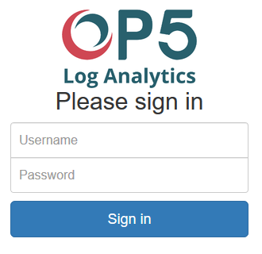
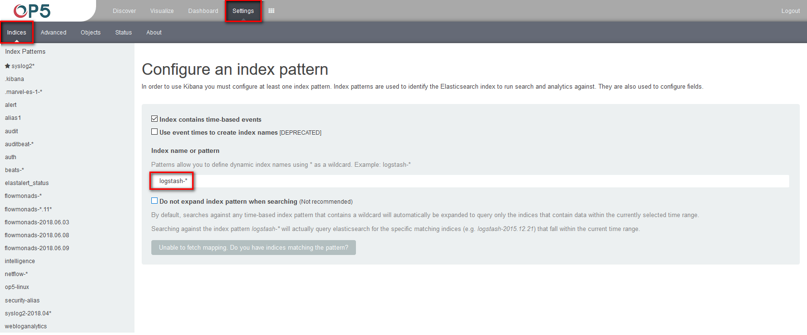
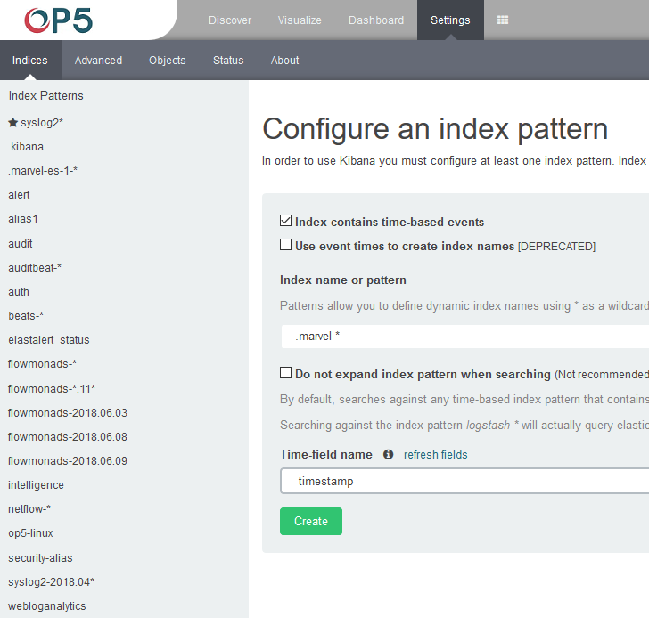

First login
-----------

> If you log in to OP5 Log Analytics for the first time, you must
> specify the Index to be searched. We have the option of entering the
> name of your index, indicate a specific index from a given day, or
> using the asterix (\*) to indicate all of them matching a specific
> index pattern. Therefore, to start working with OP5 Log Analytics
> application, we log in to it (by default the user:
> logserver/password:logserver).
>
> 
>
> The application at the first login is set by default on the tab:
> **Settings-\>Indices**
>
> 
>
> In the place where application by default sets name of the Logstash-\*
> pattern, enter the name of the index or index pattern (after
> confirming that the index or sets of indexes exists).
>
> In additional, the field name should be given, after witch individual
> event (events) should be sorter. By default the *timestamp* is set,
> which is the time of occurrence of the event, but depending of the
> preferences, it may also be the time of the indexing or other selected
> based on the fields indicate on the event.
>
> 
>
> At any time, you can add more indexes or index patters by going to the
> main tab select „Settings" and next select „Indices".
