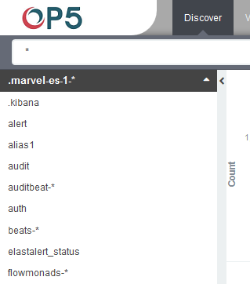

Index selection
---------------

> When first index has already been selected, the next time you log into
> OP5 Log Analytics we will going to „Discover" tab from main menu where
> all searches and operation on raw data from indexes are performed.
>
> If you want to change selected index, click on the black field with
> the name of the current object in the left panel. Clicking on the
> object from the expanded list of previously create index patterns,
> will change the searched index.

