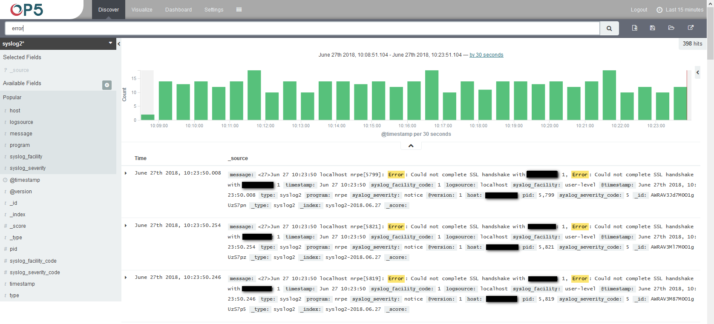

Filtering and syntax building
-----------------------------

> We use the query bar to search interesting events. For example, after
> entering the word „error", all events that contain the word will be
> displayed, additional highlighting them with an orange background.

> Fields can be used in the similar way by defining conditions that
> interesting us. The syntax of such queries is:
> „\<fields\_name\>:\<fields\_value\>", For example: „status:500". This
> query will display all events that contain the „status" fields with a
> value of 500.
>
> The field value does not have to be a single, specific value. For
> digital fields we can specify range in the following scheme:
> „\<fields\_name\>:\[\<range\_from \> TO \<range\_to\>\]", For
> example:. „status:\[500 TO 599\]". This query will return events with
> status fields that are in the range 500 to 599.
>
> The search language used in OP5 allows to you use logical operators
> „AND", „OR" and „NOT", which are key and necessary to build more
> complex queries.
>
>-   **AND** is used to combined expressions, e.g. „error AND „access
>    denied" ". If an event contain only one expression or the words
>    error and denied but not the word access, then it will not be
>    displayed.
>
>-   **OR** is used to search for the events that contain one OR other
>    expression, e.g. „ „status:500" OR denied". This query will display
>    events that contain word „denied" or status field value of 500. OP5
>    uses this operator by default, so query „ „status:500" denied" would
>    return the same results.
>
>    **NOT** is used to exclude the following expression e.g. „status:\[500
>    TO 599\] NOT status:505" will display all events that have a status
>    fields, and the value of the field is between 500 and 599 but will
>    eliminate from the result events whose status field value is exactly
>    505.
>
>-   The above methods can be combined with each other by building even
>    more complex queries. Understanding how they work and joining it, is
>    the basis for effective searching and full use of OP5 Log Analytics.
>    Example of query built from connected logical operations:
>    **status:\[500 TO 599\] AND („access denied" OR error) NOT
>    status:505**
>
> Returns in the results all events for which the value of status fields
> are in the range of 500 to 599, simultaneously contain the word
> „access denied" or „error", omitting those events for which the status
> field value is 505.
