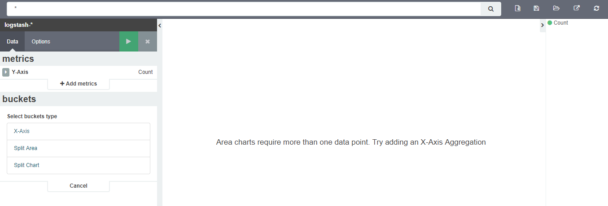
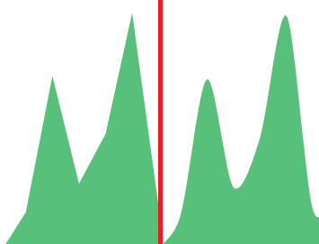
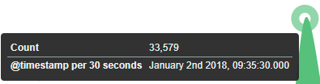
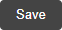

### Edit visualization and saving

After selecting the index and the method of data presentation, the
user enters the editing mode. This will open a new window with empty
visualization.

At the very top there is a bar of queries that cat be edited
throughout the creation of the visualization. It work in the same way
as in the "Discover" tab, which means searching the raw data, but
instead of the data being displayed, the visualization will be edited.
The following example will be based on the „Area chart". The
visualization modification panel on the left is divided into two tabs
-- „Data" and „Options".

In the „Data" tab, the elements responsible for which data and how
should be presented are modified. In this tab there are two sectors --
"metrics", in which we set what data should be displayed, and
„buckets" in which we specify how they should be presented. In the
„Options" tab, there are settings relating mainly to visual
aesthetics. Each type of visualization has separate options. To create
the first graph in the char modification panel, in the „Data" tab we
add X-Axis in the "buckets" sections. In „Aggregation" choose „Date
Histogram", in „Field" should automatically be located "timestamp",
and "interval" -- "Auto" (if not, this is how we set it). Click on the
icon on the panel. Now our first graph should show up.

Some of the options for „Area Chart" are:

   **Smooth Lines** -- is used to smooth the graph line.

-   **Current time marker** -- places a vertical line on the graph that
    determines the current time.

-   **Set Y-Axis Extents** -- allows you to set minimum and maximum
    values for the Y axis, which increases the readability of the
    graphs. This is useful, if we know that the data will never be
    less then (the minimum value), or to indicate the goals the
    company (maximum value).

-  **Show Tooltip** -- option for displaying the information window
    under the mouse cursor, after pointing to the point on the graph.
   
   
   
To save the visualization, click the icon
 next to the query bar, give it a name
and click the button
. To load the visualization, go to the
„Settings" tab from the main menu at the top of the page, then from
the submenu select „Objects" and finally the "Visualizations" tab.
From this place, we can also go into advanced editing mode, export and
delete visualization.
