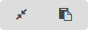

### Sharing

> The dashboard can be share with other OP5 Log Analytics users as well
> as on any page -- by placing a snippet of code, provided that it cans
> retrieve information from OP5 Log Analytics.
>
> To do this, open the saved dashboard and click on the icon
>  to the right of the query bar. A window
> will appear with two gray bars. The content of the first one is used
> to provide the dashboard in the page code, and the second is a link
> that can be passed on to another user. There are two icons next to
> them, the first is to shorten the length of the link, and second on
> copies the contest of the given bar
> 
