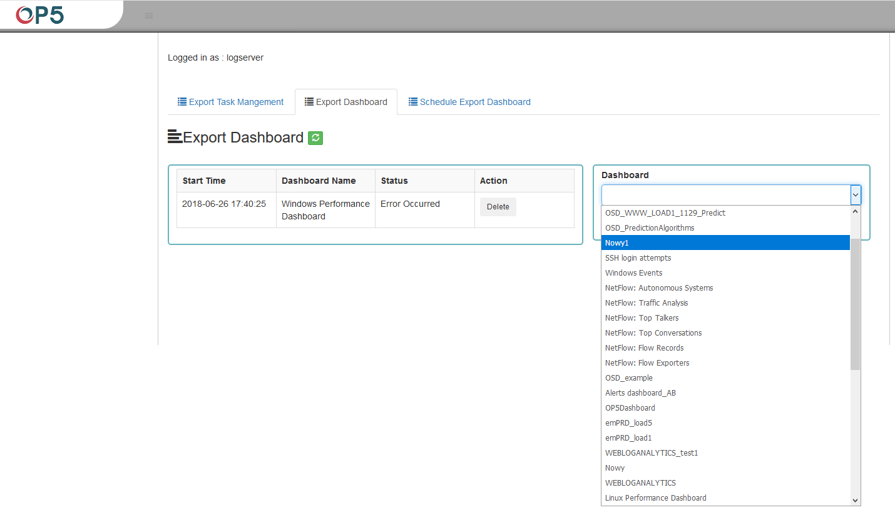
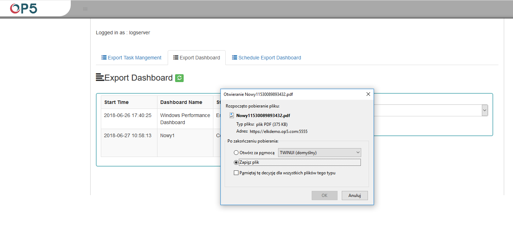
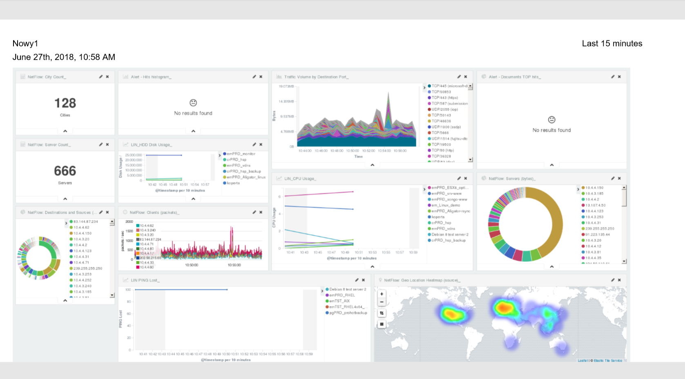

PDF Report
----------

> In the next tab of Export Dashboard we have the possibility to create
> graphic reports in the form of \*.pdf files. To create such a report,
> just from the drop-down list of previously created and saved
> Dashboards, indicate the one we are interested in, and then confirm
> the selection with the Submit button. A newly created export with the
> Processing status will appear on the list under Dashboard Name. When
> the processing is completed, the Status changes to Complete and it
> will be possible to download the report.
>
> 
>
> By clicking the Download button, the report is downloaded to the disk
> or we can open it in the \*.pdf file browser. There is also to option
> of deleting the report with the Delete button.
>
> 
>
> Below is an example report from the Dashboard template generated and
> downloaded as a \*.pdf file.
>
> 
