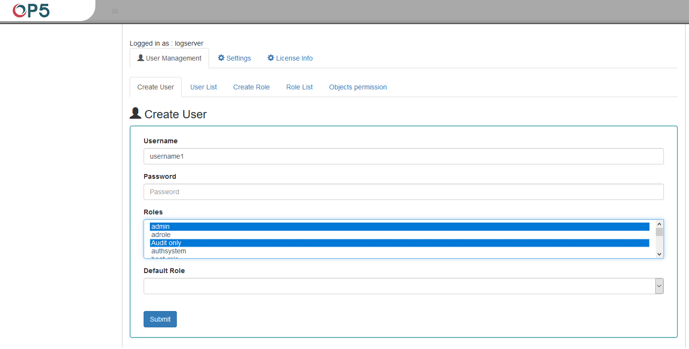

Creating a User (Create User)
-----------------------------

> After clicking the Config icon, we immediately enter the
> administration panel where the first tab is to create a new user
> (**Create User**).

{width="6.272222222222222in"
height="3.1841229221347334in"}

> In the wizard that opens for us, we have the possibility to enter a
> unique username (Username field), password for the user (field
> Password) and assign a role (field Role). In this field we have the
> option of assigning more than one role. Until we select role in the
> Roles field, the Default Role field remains empty. When we mark
> several roles, these roles appear in the Default Role field. In this
> field we have the opportunity to indicate which role for a new user
> will be the default role with which the user will be associated in the
> first place when logging in. The default role field has one more
> important task -- it binds all users with the field / role set in one
> group. When one of the users of this group create Visualization or
> Dashboard it will be available to other users from this role(group).
> Creating the account is confirmed with the Submit button.
