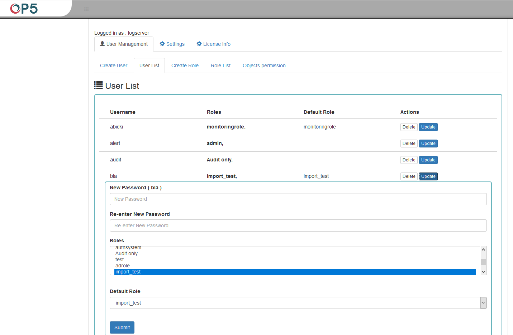

User's modification and deletion, (User List)
---------------------------------------------

Once we have created users, we can display their list. We do it in
next tab (**User List**).

In this view, we get a list of user account with assigned roles and we
have two buttons: Delete and Update. The first of these is ability to
delete a user account. Under the Update button is a drop-down menu in
which we can change the previous password to a new one (New password),
change the password (Re-enter Ne Password), change the previously
assigned roles (Roles), to other (we can take the role assigned
earlier and give a new one, extend user permissions with new roles).
The introduced changes are confirmed with the Submit button.

We can also only see which user has the settings, and seeing them
again, clicking the Update button collapses the previously expanded
menu.
