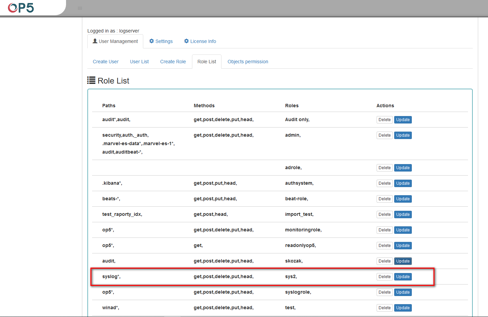
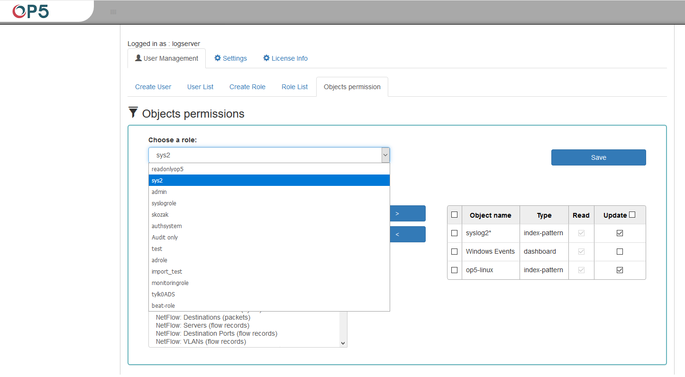
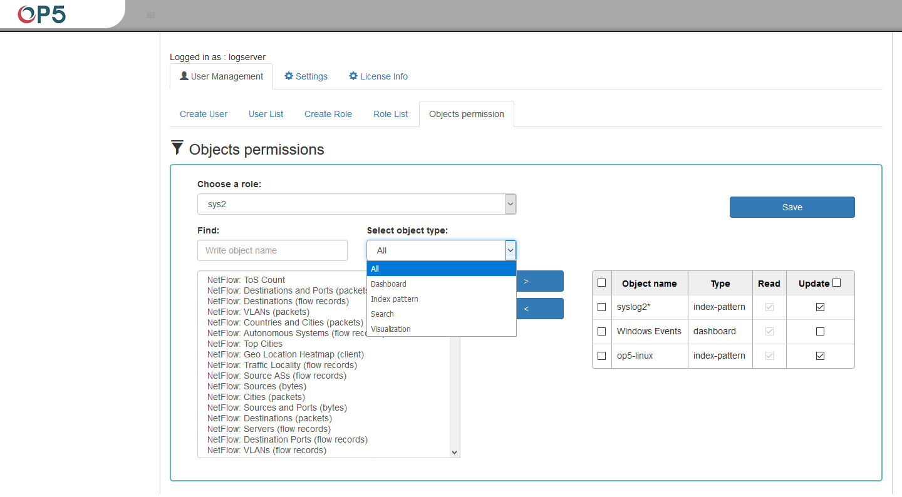

Object access permissions (Objects permissions)
-----------------------------------------------

> This is last tab in the User Manager section. It serves to
> parameterize access to the newly created role as well as existing
> roles. In this tab we can indicate to which object in the application
> the role has access.
>
> We will explain this by an example.
>
> In the Roles of the List tab we have a role called **sys2**, it refers
> to all index patterns beginning with syslog\* and the methods get,
> post, delete, put and head are assigned.
>
> 
>
> When we go to the Object permission tab, we have the option to choose
> the sys2 role in the drop-down list choose a role:
>
> 
>
> After selecting, we can see that we already have access to the object:
> in this case, two index patterns syslog2\* and op5-\* and on dashboard
> Windows Events. There are also appropriate read permissions or updates
> to perform.
>
> 
>
> From the list we have the opportunity to choose another object that we
> can add to the role, we have the ability to quickly find this object
> in the search engine (Find) as well as narrowing the object class in
> the drop-down field Select object type. The object type are associated
> with saved, previously created by the user / users documents in the
> sections Dashboard, Index pattern, Search , Visualization. By buttons
> we have the ability to add or remove or
> object, and Save button to save the selection.
