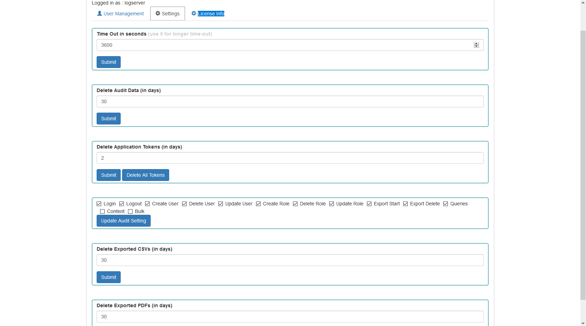

Settings
--------

> The Settings tab is used to set the audit on different activates /
> events and consists of several fields:

-   Time Out in seconds field -- this field defines the time after how
    many minutes the application will automatically log you off

-   Delete Audit Data (in days) field -- in this field we specify after
    what time the data from the audit should be deleted

-   Delete Application Tokens (in days) -- in this field we specify
    after what time the data from the audit should be deleted

-   Next field are checkboxes in which we specify what kind of events
    are to be logged (saved) in the audit index. The events that can be
    monitored are: logging (Login), logging out (Logout), creating a
    user (Create User), deleting a user (Delete User), updating user
    (Update User), creating a role (Create Role), deleting a role
    (Delete Role), update of the role (Update Role), start of export
    (Export Start), delete of export (Export Delete), queries (Queries),
    result of the query (Content), if attempt was made to perform a
    series of operation (Bulk)

-   Delete Exported CSVs (in days) field-- in this field we specify
    after which time exported file with CSV extension have to be removed

-   pole Delete Exported PDFs (in days) -- in this field we specify
    after which time exported file with PDF extension have to be removed

-   To each field is assigned button thanks to which we can confirm the
    changes.
