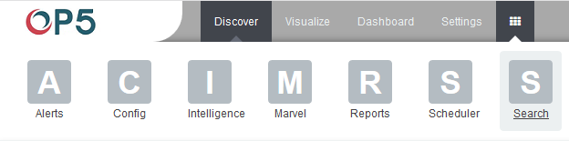
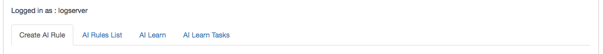

Intelligence Module
===================

> A dedicated artificial intelligence module has been built in the OP5
> Log Analytics system that allows prediction of parameter values
> relevant to the maintenance of infrastructure and IT systems. Such
> parameters include:
>
> • use of disk resources,
>
> • use of network resources,
>
> • using the power of processors
>
> • detection of known incorrect behavior of IT systems
>
> In the future, it is planned to launch algorithms that enable
> automatic detection of anomalies, e.g. non-standard network traffic,
> which may suggest hacking attempts.
>
> (A detailed description of the implemented algorithms can be found in
> a separate document)
>
> To go to the window of the Intelligence module, select the tile icon
> from the main meu bar and then go to the „Intelligence" icon (To go
> back, go to the „Search" icon).
>
> {width="5.572222222222222in"
> height="1.3841262029746282in"}
>
> There are 4 screens available in the
> module:

-   Create AI Rule -- the screen allows you to create artificial
     intelligence rules and run them in scheduler mode or immediately

-   AI Rules List -- the screen presents a list of created artificial
     intelligence rules with the option of editing, previewing and
     deleting them

-   AI Learn -- the screen allows to define the conditions for teaching
     the MLP neural network

-   AI Learn Tasks -- a screen on which the initiated and completed
     learning processes of neural networks with the ability to preview
     learning results are presented
