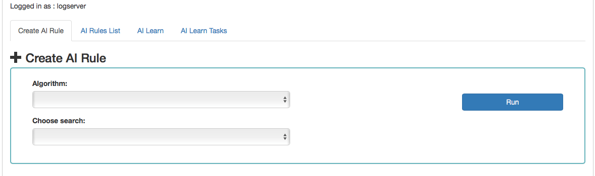

Create AI Rule
--------------

The screen allows to defining the rules of artificial intelligence
based on one of the available algorithms (a detailed description of
the available algorithms is available in a separate document).

### The fixed part of the screen

Description of the controls available on the screen:

• Algorithm -- the name of the algorithm that forms the basis of the
artificial intelligence rule

• Choose search -- search defined in the OP5 Log Analytics system,
which is used to select a set of data on which the artificial
intelligence rule will operate

• Run -- a button that allows running the defined AI rule or saving it
to the scheduler and run as planned

The rest of the screen will depend on the chosen artificial
intelligence algorithm.
