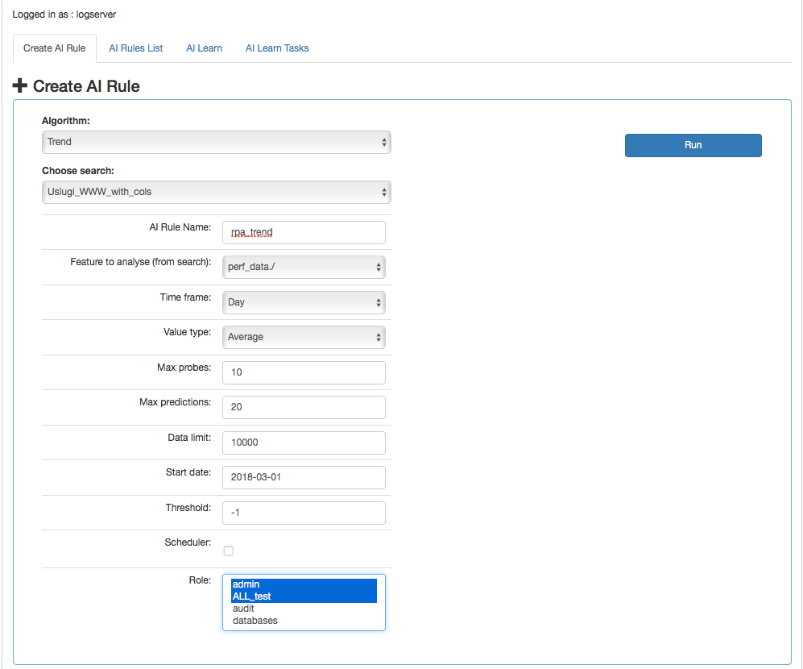

### Screen content for the Trend algorithm

Description of controls:

-   All controls are the same as regression algorithms

-   threshold -- default values -1 (do not search). Specifies the
    algorithm what level of exceeding the value of the feature „feature
    to analyze from cheese" is to look for. The parameter currently used
    only by the "Trend" algorithm.
