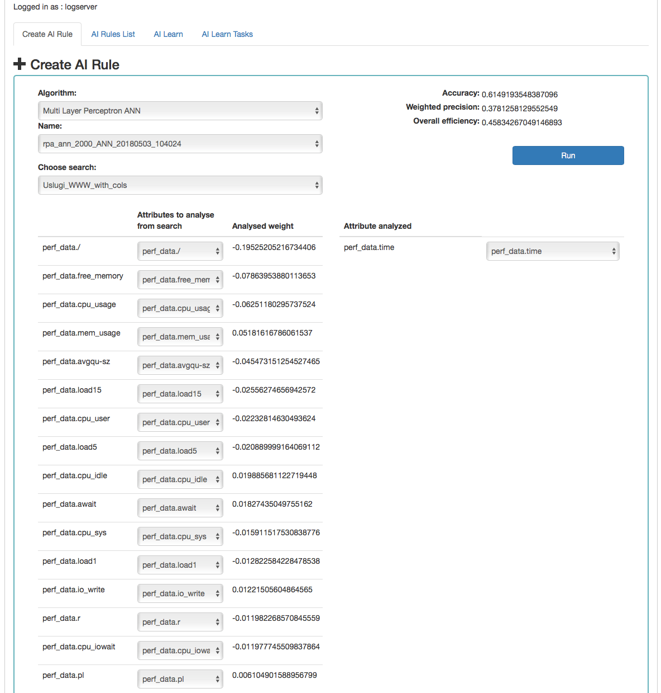
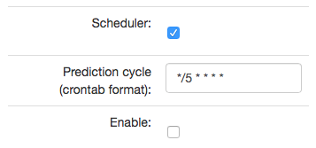

### Screen content for the neural network (MLP) algorithm

> Descriptions of controls:

-   Name -- name of the learned neural network

-   Choose search -- search defined in OP5 Log Analytics, which is used
    to select a set of data on which the rule of artificial intelligence
    will work

-   Below, on the left, a list of attributes and their weights based on
    teaching ANN will be defined during the teaching. The user for each
    attribute will be able to indicate the field from the above
    mentioned search, which contain the values of the attribute and
    which will be analyzed in the algorithm. The presented list (for
    input and output attributes) will have a static and dynamic part.
    Static creation by presenting key with the highest weights. The key
    will be presented in the original form, i.e. perf\_data./ The second
    part is a DropDown type list that will serve as a key update
    according to the user's naming. On the right side, the attribute
    will be examined in a given rule / pattern. Here also the user must
    indicate a specific field from the search. In both cases, the input
    and output are narrowed based on the search fields indicated in
    Choose search.

-   data limit -- limits the amount of data downloaded from the source.
    It speeds up the processing, but reduces its quality.

-   Scheduler -- a tag if the rule should be run according to the plan
    or the scheduler. If selected, additional fields will appear:

-   Prediction cycle -- plan definition for the scheduler, i.e. the
     cycle in which the prediction rule is run (e.g. once a day, every
     hour, once a week). In the field, enter the command that complies
     with the cron standard

-   Enable -- whether to immediately launch the scheduler plan or save
     only the definition

<!-- -->

-   Role -- only users with the roles selected here and the
     administrator will be able to run the defined AI rules
