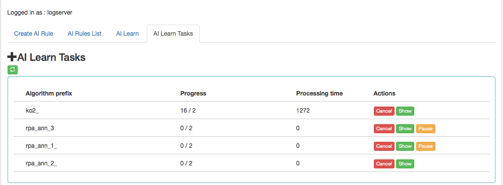

AI Learn Tasks
--------------

> The tab shows the list of processes initiated teaching the ANN network
> with the possibility of managing processes.
>
> Each user can see only the process they run. The user in the role of
> Intelligence sees all running processes.
>
> 
>
> Description of controls:

-   Algorithm prefix -- this is the value set by the user on the AI
    > Learn screen in the Prefix name fieldProgress -- here is the
    > number of algorithms generated / the number of all to be generated

-   Processing time -- duration of algorithm generation in seconds (or
    > maybe minutes or hours)

-   Actions:

    -   Cancel -- deletes the algorithm generation task (user require
        > confirmation of operation)

    -   Pause / Release -- pause / resume algorithm generation process

-   AI Learn tab contain the Show in the preview mode of the ANN
    > hyperparameters

-   After completing the learning activity or after the user has
    > interrupted it, the "Delete" button appears int "Action"field.
    > This button allows you to permanently delete the learning results
    > of a specific network.

> 
